# Item Catalog

> By: Mohamed Fawzy

## About

This is a project for the Udacity Full Stack Nanodegree Program. The Item Catalog is an application that provides a list of items within a variety of Restaurants as well as provide a user registration and authentication system. Registered users will have the ability to post, edit and delete their own items.

A user does not need to be logged in in order to read the restaurants or items uploaded. However, users who created an item are the only users allowed to update or delete the item that they created.

This program uses third-party auth with Google. Some of the technologies used to build this application include Flask, Bootsrap, Jinja2, and SQLite.

### Skills used for this project
- Python
- HTML
- CSS
- Bootstrap
- Flask
- Jinja2
- SQLAchemy
- OAuth
- Google Login

### Important links:
* [Python2.7](https://www.python.org/downloads/)
* [Vagrant](https://www.vagrantup.com/)
* [Udacity Vagrantfile](https://github.com/udacity/fullstack-nanodegree-vm)
* [VirtualBox](https://www.virtualbox.org/wiki/Downloads)

## Getting Started
#### PreRequisites
- Install Vagrant and VirtualBox
- Clone the Vagrantfile from the Udacity Repo
- Clone this repo into the `catlog/` directory found in the Vagrant directory
- Run `vagrant up` to run the virtual machine, then `vagrant ssh` to login to the VM
#### Running
From the main project directory run:
* `$ sudo pip install -r requirements` - To install the required packages
* `$ database_setup.py` - To initialize the database
* `$ lotsofmenus.py` - To create a dummy user, restaurants and menu items
* `$ python project.py` - To start the application
* Go to `http://localhost:5000/` in your browser to access the application
* If it is the first time running, You must add a restaurant before adding an item

## JSON Endpoints

`/api/v1/restaurants/JSON` - Returns JSON of all restaurants

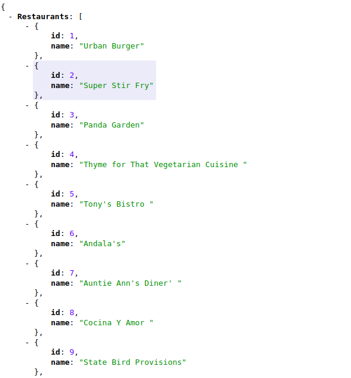

`/api/v1/restaurant/<int:restaurant_id>/<int:menu_id>/JSON` - Returns JSON of selected item in restaurant

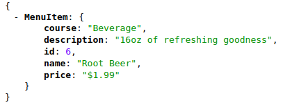

`/api/v1/restaurant/<int:restaurant_id>/menu/JSON` - Returns JSON of all items in restaurant

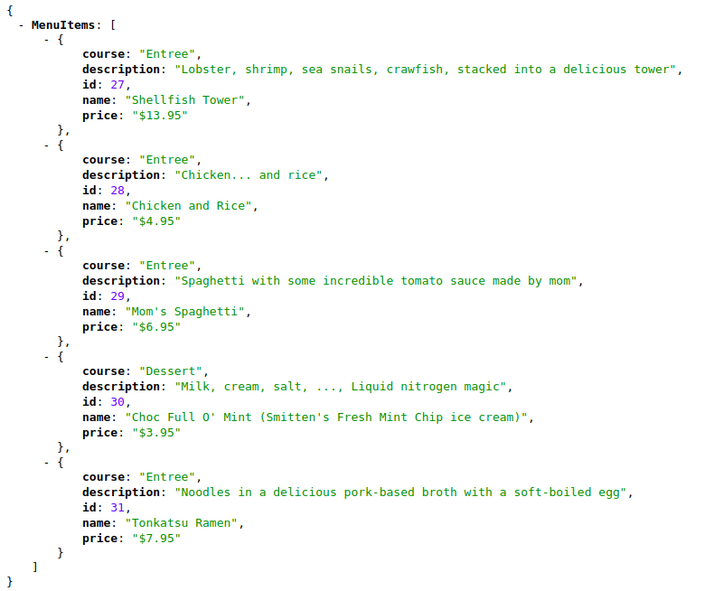

## REST Endpoints

##### --------------------------------------
##### CRUD for restaurants
##### --------------------------------------

`/` or `/restaurants` - Returns catalog page with all restaurants and recently added items

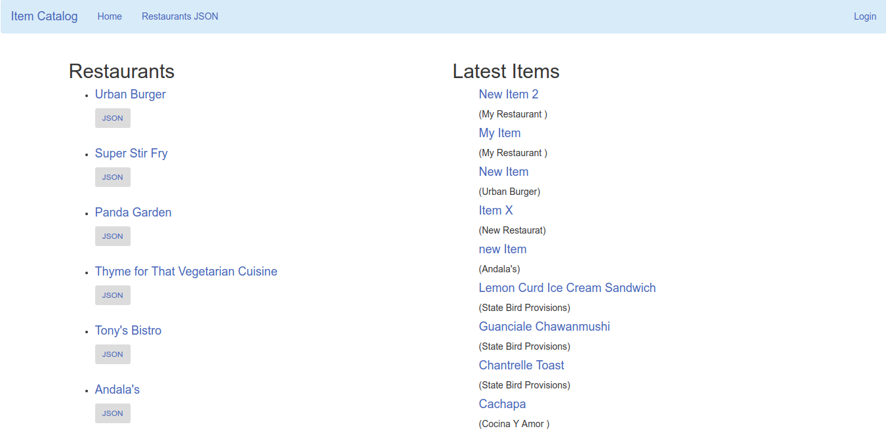

`/` or `/restaurants` - Returns catalog page with all restaurants and recently added items and the user is logged in

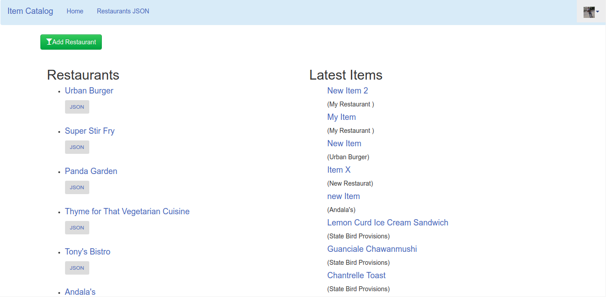

`/restaurant/new` - Allows user to create new restaurant

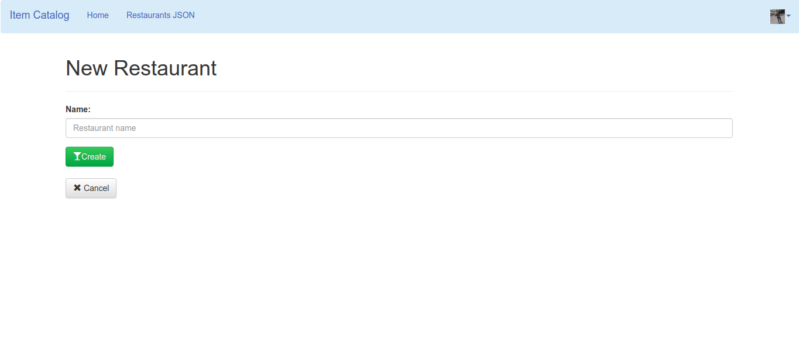

`/restaurant/<int:restaurant_id>/edit/` - Allows user to edit an existing restaurant

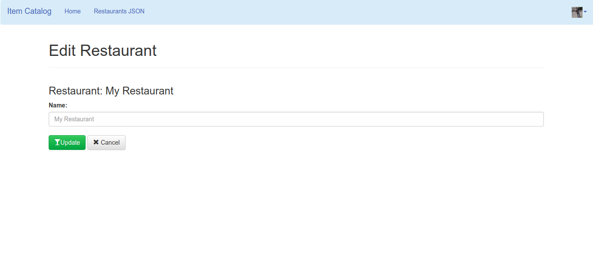

`/categories/<int:restaurant_id>/delete/` - Allows user to delete an existing restaurant

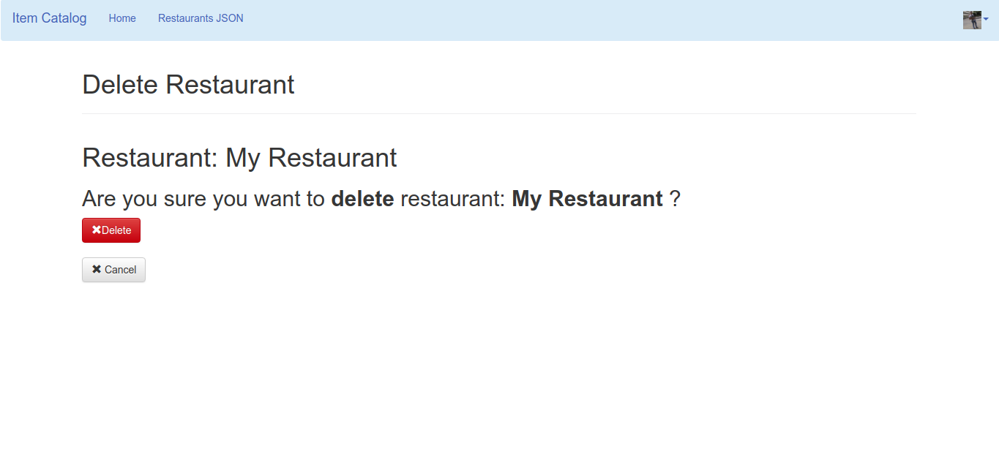

##### --------------------------------------
##### CRUD for menu items
##### --------------------------------------

`/restaurant/<int:restaurant_id>/` or `/restaurant/<int:restaurant_id>/menu/` - returns menu of a restaurant

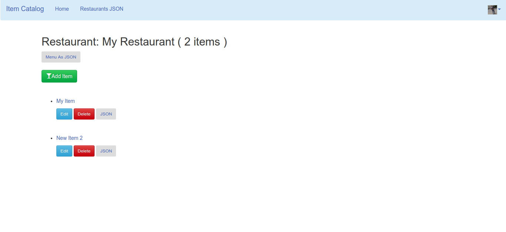

`/restaurant/<int:restaurant_id>/menu/<int:menu_item_id>/` - returns a specific menu item

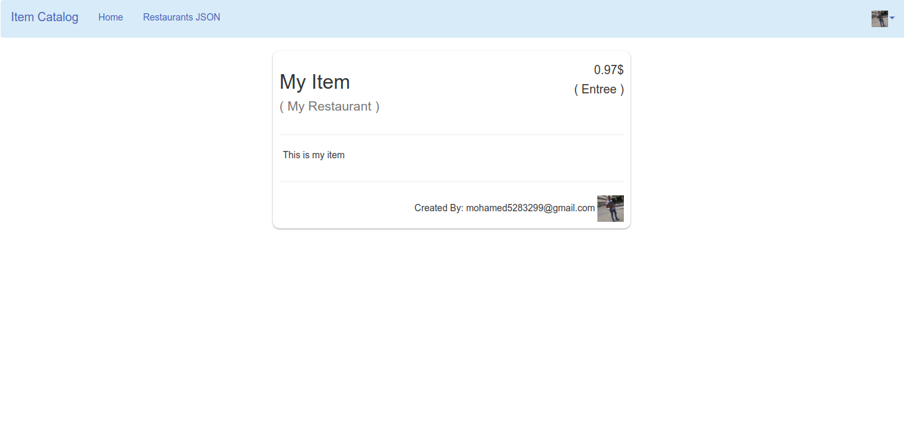

`/restaurant/<int:restaurant_id>/menu/new` - returns a form for creating a new menu item

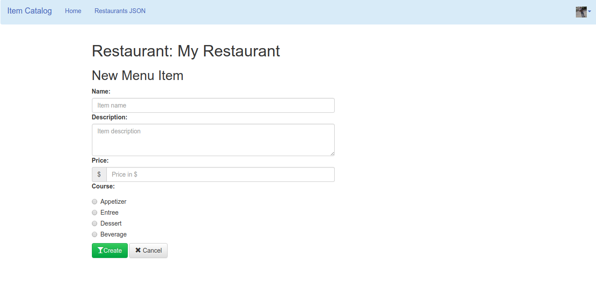

`/categories/<int:category_id>/item/<int:catalog_item_id>/edit` - returns a form for editing a menu item

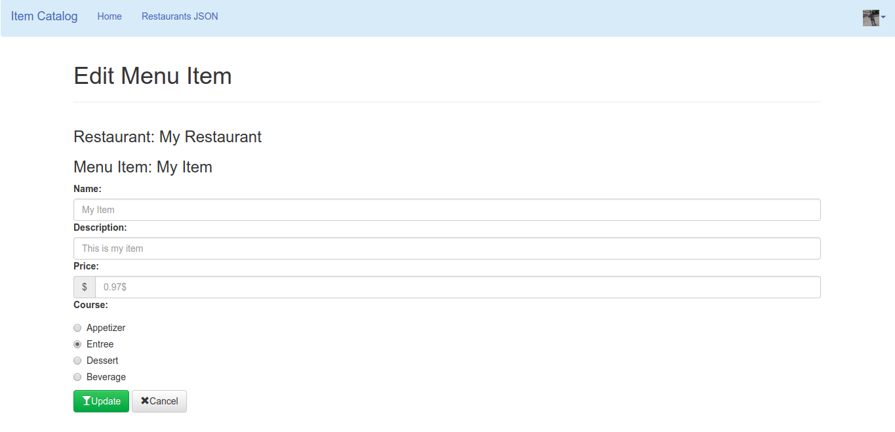

`/restaurant/<int:restaurant_id>/menu/<int:menu_id>/delete` - returns a form for deleting a menu item

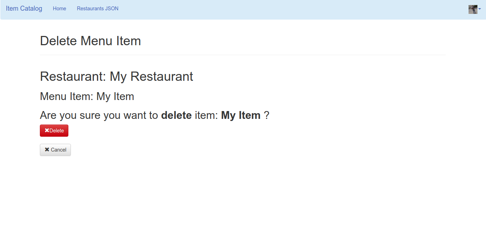

## Possible improvements
- Image Upload, Possible future addition with file upload
- Styling and layout could be improved
- Implement CSRF protection on CRUD operations.